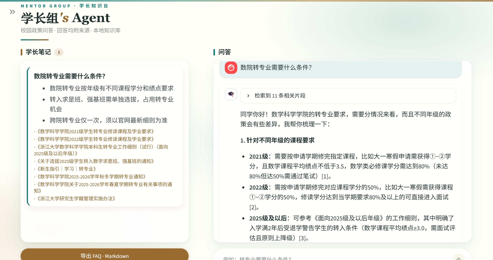
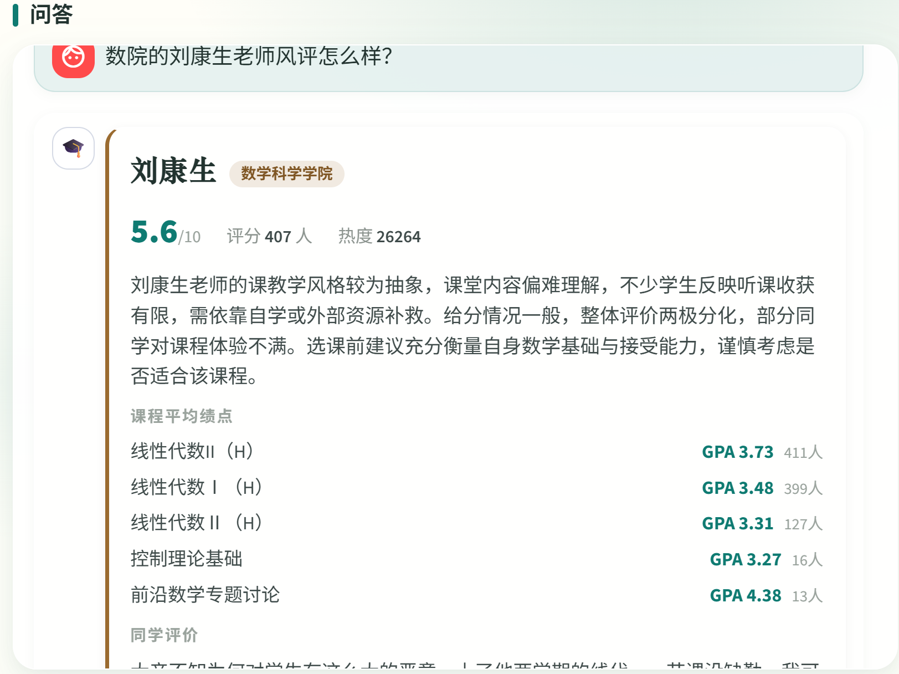
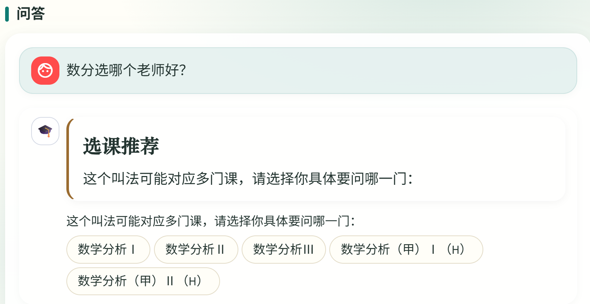

# 学长组 Agent

## 结构

```
mentor-agent/
├── KB_FORMAT.md          # 知识库文档格式规范（数据组必读）
├── QUESTION_FORMAT.md    # 真实问题收集与评测样本规范
├── KB_GOVERNANCE_REPORT.md # 治理结果与人工复核队列
├── knowledge_base/       # 独立知识库子模块（正式目录 + chalaoshi 原始评教 + 统一黑话 slang.json）
├── ingest.py             # CLI：默认仅入库 verified（--rebuild 全量重建）
├── import_teachers.py    # 导入查老师原始数据（knowledge_base/chalaoshi → data/teacher.db）
├── scripts/govern_kb.py  # schema 审计、迁移和精确去重
├── scripts/mine_course_slang.py  # 从评教评论挖掘课程黑话候选（供人工确认）
├── app.py                # 入口：登录门禁 + 页面导航
├── ui/                   # Streamlit 界面：问答 / 登录注册 / 用户管理
├── data/auth.db          # 用户库（自动创建，不进 git）
├── core/                 # 业务逻辑
│   ├── config.py         #   路径/常量/env 统一入口
│   ├── kb_schema.py      #   知识文档 schema v2 规范化与校验
│   ├── chunking.py       #   文档切块
│   ├── embeddings.py     #   embedding 后端（local/api 可切换）
│   ├── retrieval.py      #   BM25+向量混合召回 → RRF 融合 → 交叉编码重排
│   ├── llm.py            #   回答生成 / 多轮问题改写 / 笔记要点压缩
│   ├── notes.py          #   来源去重 / FAQ 导出
│   ├── teachers.py       #   查老师：数据模型 + 权重评分 + 课程黑话反查
│   └── slang.py          #   校园黑话加载/展开（type=rag 检索扩展 / type=course 课程反查）
├── tests/test_core.py    # 纯函数测试：python tests/test_core.py
├── tests/test_teachers.py # 查老师测试：python tests/test_teachers.py
├── .env.example          # 配置模板，复制为 .env 后填写
├── DEPLOY.md             # 服务器部署指南（Docker / 源码 + systemd）
├── Dockerfile            # 配套 compose.yaml 使用，见 DEPLOY.md
├── requirements.txt      # 直接依赖源清单
├── requirements.lock     # Python 3.12 生产/CI 哈希锁文件
└── deploy/               # 生产配置模板、Caddy 与运维手册
```

## 效果展示

典型提问与对应输出：

**校园政策检索问答** —— 问："数院转专业需要什么条件？"

```text
[问答卡片 / 检索回答]
```



**查老师 / 课程推荐** —— 问："数院的刘康生老师风评怎么样？"

```text
[老师卡片：课程名 / 评分 / 精选评论 / gpa]
```



**课程黑话反查** —— 问："数分选哪个老师好？"

```text
[课程推荐卡片：先确认具体是哪一门课，再列出该课程的老师]
```

数分这类一对多黑话，会先弹出课程选择：



选中具体课程后，折叠成该课程的老师推荐卡片：


## 快速开始

#### 1.安装依赖
```bash
pip install -r requirements.lock
```
> 这里建议使用虚拟环境。修改依赖时改 `requirements.txt` 并重新生成 lock，
> 不要直接手改 `requirements.lock`。
#### 2. 配置：复制 .env.example 为 .env，填入 API Key（Windows 直接复制粘贴改名即可）
>    LLM_API_KEY / LLM_BASE_URL / LLM_MODEL，任何 OpenAI 兼容接口都行。.env 还需配置 AUTH_SECRET（生成方式见 .env.example）；SMTP 留空则验证码打印在控制台（开发模式）。

#### 3. 初始化知识库子模块，并按 KB_FORMAT.md 审计

```bash
git submodule update --init --recursive
python scripts/govern_kb.py
```

只有 `release_ready=true` 且命令退出码为 0 才能进入下一步。生产只发布
`valid:true + verified` 文档；自动采集的 `needs_review` 默认隔离，不能直接标为 `verified`。

#### 4. 建库（增量：只处理新增/变更的文档；文档有更新就重跑）
```
python ingest.py
#    换了 embedding 模型后必须全量重建：
# python ingest.py --rebuild
#    仅开发/审核环境临时包含 needs_review：
# python ingest.py --include-needs-review
```

#### 5. 建查老师库（评教数据 → 授课/课程推荐查询）
```
python import_teachers.py --no-llm
#     --no-llm 参数可以不加，效果会略好一点，但是很慢
#    改了导入逻辑或 schema 变更后需重建（--force 会重建混合候选）：
# python import_teachers.py --force
#    想跳过某些学院的评论混入审查，用 --mixed-ids=1,2,3（见脚本 --help）
```
原始评教数据来自 `knowledge_base/chalaoshi/`（comment_ 各学院 CSV + teachers.csv + gpa.json，随 KB 子模块拉取）。

#### 6. 启动
```
streamlit run app.py
```
想要「用户管理」页，先在 .env 里填 `ADMIN_EMAILS=你的邮箱@zju.edu.cn`，注册后即为管理员
（老账号加进名单后退出重登生效）；也可对已注册账号跑 `python scripts/make_admin.py 你的邮箱`。

首次运行会下载中文 embedding 模型 bge-small-zh（约 100MB）和重排模型
bge-reranker-base（约 1.1GB，可在 .env 里设 `RERANK_MODEL=off` 跳过）。
国内网络走 hf-mirror 镜像；本机开着代理（Clash 等）导致下载失败时，
代码会自动绕开代理直连镜像。

> 部署到 Linux 服务器（Docker 或源码 + systemd）见 [DEPLOY.md](DEPLOY.md)。
> 上线预检、环境隔离、备份恢复和回滚流程见 [deploy/OPERATIONS.md](deploy/OPERATIONS.md)。

## 知识库规模

截至 2026-08-16，知识库（knowledge_base 子模块，正式发布目录）规模：

| 指标 | 数量 |
|---|---|
| 权威来源（学院/部处/校级站点等，按 source_org 归一去重） | **64** |
| 入口文档（正式发布 md，排除 staging） | **10,909** |
| 检索块（chroma 向量库 senior_agent 集合） | **76,289** |

顶层分类分布：通知 6,582 篇、FAQ 2,295 篇、政策 1,937 篇、zju-welcome 新生指引 95 篇。

重新统计：`python scripts/kb_stats.py`（来源数/入口 md 数）；块数以 `python ingest.py` 末尾打印的"库中共 N 条"为准。

## 检索管线

问题 →（多轮追问先由 LLM 改写成独立问题）→ 向量召回 + BM25 关键词召回
→ RRF 融合 top20 → bge-reranker 重排 → top5 + 覆盖补位 → 连同知识库目录（统一编号）喂给 LLM 生成。
LLM 在正文中用 [n] 标注每句话的来源；流式结束后按首次出现顺序重编号为 [1][2][3]…
（`renumber_citations`），回答下方的来源清单随之生成；LLM 没标注时退回"检索命中去重"兜底。

- 覆盖补位：枚举类问题（"求是科学班有哪几种"）下所有相关文档重排得分都高，
  top5 会被少数几篇的多个块占满；对得分 ≥0.5 但还没进结果的文档各补最优一块
  （最多 +5，见 `core/config.py`）。细节类问题无关文档得分接近 0，不触发。
- 知识库目录：全部文档标题清单随每次提问注入 prompt，保证"有哪些/多少个"
  这类问题即使补位装不下也能数全。
- 重排模型加载失败会自动降级为 RRF 排序，不影响可用性
- `ingest.py` 跑完后需重启 app，BM25 内存索引才能看到新文档


## 一个月版本 TODO

- [ ] 爬虫定时抓取通知 -> 自动生成规范 markdown -> 增量入库（已支持增量）
- [x] 检索评测脚本：问题集批量跑分，防改动回归（`tests/eval_retrieval.py`）
- [ ] 按 `QUESTION_FORMAT.md` 扩充真实问题并增加答案、引用和拒答评测
- [x] 混合检索（BM25 + 向量）+ 重排，提升政策条款类问题命中率
- [x] 多轮追问改写（检索前把"那时间呢？"改写成独立问题）
- [ ] 笔记/对话落盘（SQLite）+ 回答有用性反馈
- [x] 统计每日提问数量，并收集知识库无法覆盖的问题
- [x] 接入查老师数据库，以增加查询课程与授课老师的评价
