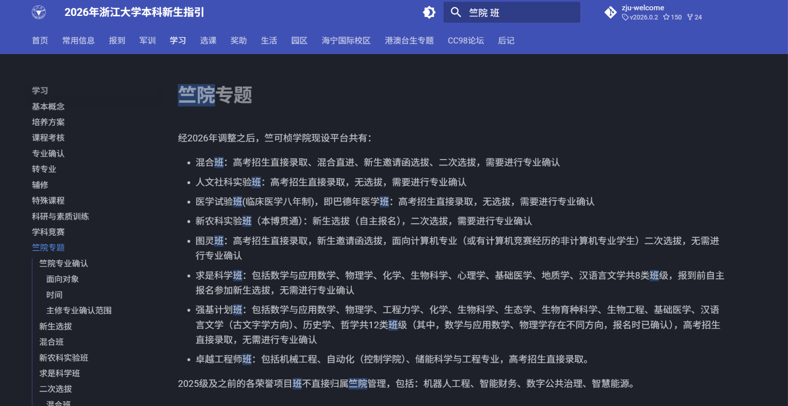
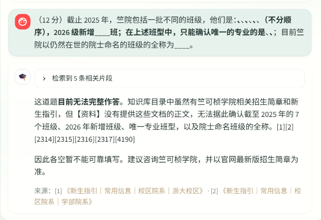
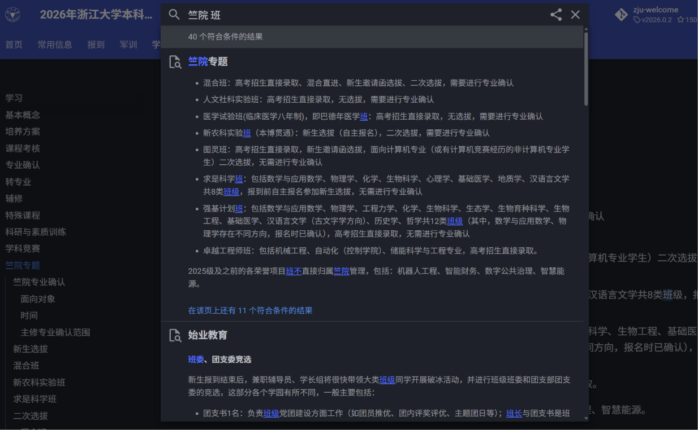
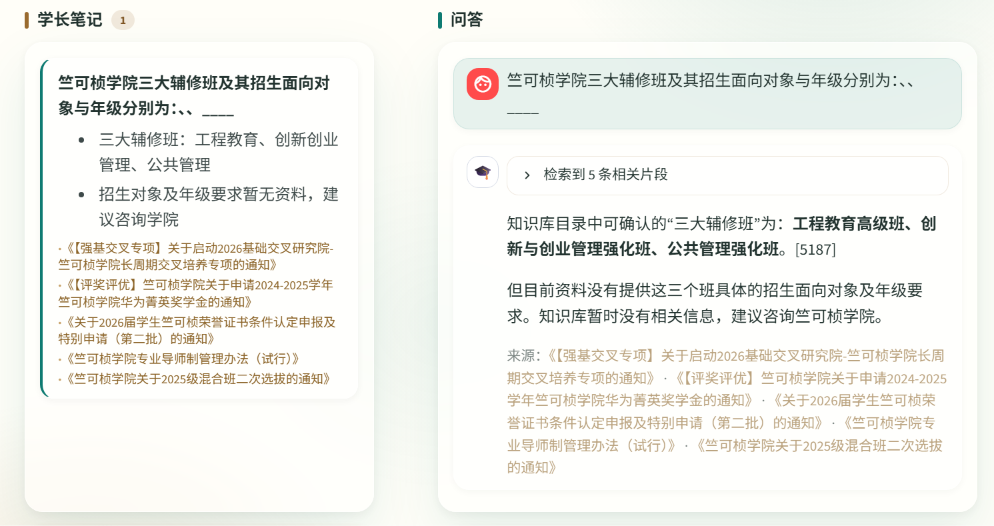

# 问题

## 搜索不到文章

有搜索不到文章的情况





原因应该是本地的文章只依靠标签并不能很好实现搜索功能

### 改进方法 old

在[github.com/kaixuanwang2003/zju-welcome](https://github.com/kaixuanwang2003/zju-welcome/) 这个仓库里面看他是怎么实现搜索功能的，制作一个cli接口，然后给agent用

可以小幅先在knowledge_base\zju-welcome这里面试实现，如果可以可以推广到全平台



 下载ugrep，可以多关键词搜索得到和上面网页搜索几乎一模一样的结果，然后问题转化为怎么让agent搜索“竺院 班”

### 改进方案 new

阿里云百炼已经把RAG做得很完善了，同时ckc/竺院/竺可桢学院/荣誉学院都对应到竺院这种意义上的模糊、语义搜索都足够好用

接入这个之后只需要做一个支付接口和知识库就好了

## 其他

添加一个清楚聊天记录的按钮

删除

```html
<div class="brand-sub">校园政策问答 · 回答均附来源 · 知识库 31027 个片段</div>
```

百事通的好像用不到，可以删掉

前端很卡，要优化性能

给出了正确的结果和参考文件的编号，但是实际显示的参考文献不准确，貌似是按照先后顺序截取了前5条


